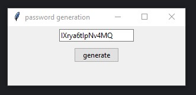

# Password Generator



🔄 Simple GUI password generator built with Python and Tkinter.

## Features

✅- **Generates secure random passwords using `secrets` module**
✅- **Clean, centered GUI interface**
✅- **One-click password generation**
✅- **10-character URL-safe passwords**

## Requirements

- Python 3.x
- tkinter (usually included with Python)

## Usage

```bash
python password_generator.py
```

Click "generate" to create a new password. The password appears in the text field and can be copied.


The app opens as a small centered window with an input field and generate button.